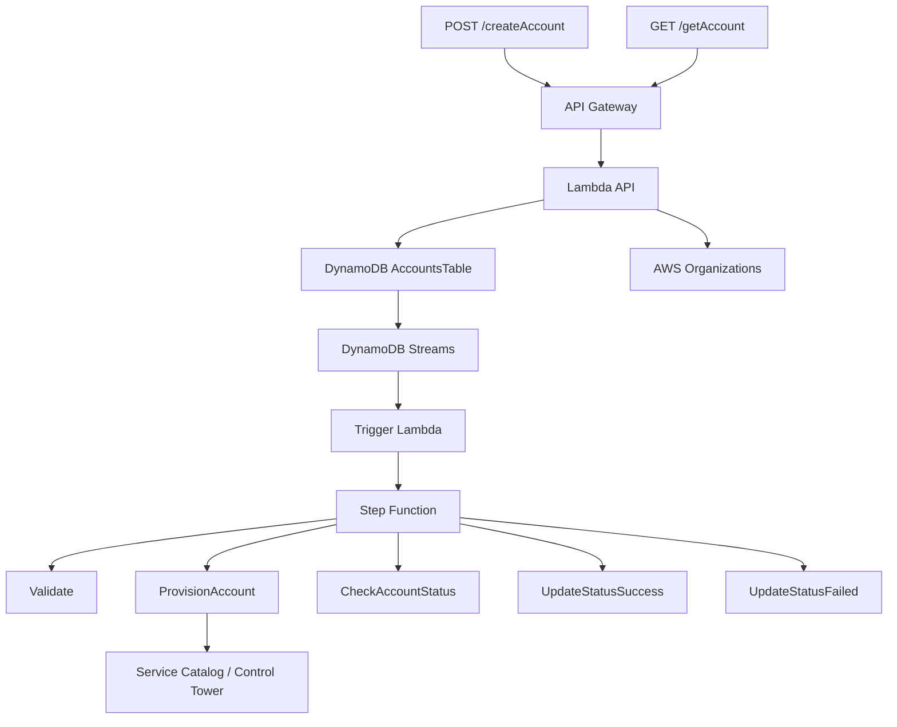

[Projeto no GitHub: DavidFerreira21/api-account-factory](https://github.com/DavidFerreira21/api-account-factory)

O **Accounts API** foi criado para remover etapas manuais do processo de criação de contas AWS em ambientes com **Control Tower** e **Service Catalog**, expondo uma API REST única para fluxos internos da organização.

Na prática, a solução permite que portais internos, ITSM, pipelines CI/CD e outros orquestradores solicitem novas contas AWS de forma padronizada, com validação de entrada, persistência com rastreabilidade e acompanhamento do provisionamento até o estado final.

## Contexto

Em muitas organizações, a criação de contas AWS ainda depende de passos manuais, validações espalhadas e consultas operacionais pouco previsíveis. Isso aumenta o tempo de atendimento, dificulta integração com automações corporativas e reduz a rastreabilidade do processo.

Quando esse fluxo passa a ser consumido por múltiplos times, o problema deixa de ser apenas operacional. Ele vira um tema de governança, porque a organização precisa garantir:

- entrada padronizada;
- validação consistente de dados;
- prevenção de duplicidade;
- observabilidade do andamento;
- histórico confiável de quem pediu, quando pediu e em que estado o processo está.

Foi exatamente esse problema que motivou o projeto.

## Objetivo

O objetivo do Accounts API é transformar a criação de contas AWS em um fluxo integrável por API, com quatro capacidades centrais:

- receber pedidos por uma interface REST única;
- validar e normalizar dados antes do provisionamento;
- persistir o pedido com `RequestID`, status e timestamps;
- provisionar de forma assíncrona e permitir consulta posterior por API.

## TL;DR

O fluxo principal é este:

`POST /createAccount -> DynamoDB + Streams -> Step Function -> GET /getAccount`

Em vez de bloquear a chamada até o término do provisionamento, a API registra a solicitação, dispara o processamento assíncrono e expõe o estado da conta para consulta posterior.

## Arquitetura e fluxo

A arquitetura é simples no desenho, mas resolve bem a separação entre entrada síncrona, orquestração assíncrona e rastreabilidade operacional.



Resumo do papel de cada bloco:

- **API Gateway + Lambda API** recebem os pedidos e fazem a camada síncrona de validação e persistência.
- **DynamoDB** guarda o estado operacional da solicitação.
- **DynamoDB Streams** dispara o fluxo assíncrono apenas para novos itens com status inicial.
- **Trigger Lambda** inicia a execução da Step Function.
- **Step Functions** coordena validação, provisionamento, polling de status e atualização final.
- **Bootstrap Lambda** sincroniza contas já existentes no Organizations fora do fluxo principal de criação.

## Endpoints da API

Os endpoints canônicos do projeto são:

- `POST /createAccount`
- `GET /getAccount`

### POST /createAccount

Esse endpoint recebe a solicitação de criação de conta. O payload exige os campos principais do processo:

- `AccountEmail`
- `AccountName`
- `OrgUnit`
- `SSOUserEmail`
- `SSOUserFirstName`
- `SSOUserLastName`

As regras importantes aqui são:

- e-mails e nomes-chave são normalizados para reduzir inconsistência;
- a OU pode ser informada em formato simples, como `Engineering`, ou em caminho completo, como `Engineering/Platform/Dev`;
- a API consulta o **AWS Organizations** para validar a OU;
- o item é gravado no DynamoDB com `Status=Requested`;
- a gravação usa `ConditionExpression` para evitar sobrescrita e duplicidade por `AccountEmail`.

Respostas esperadas:

- `201 Created`
- `400 Bad Request`
- `409 Conflict`
- `500 Internal Server Error`

### GET /getAccount

Esse endpoint existe para consulta de estado. O uso recomendado é por `accountEmail`, embora também seja possível consultar por `accountId`.

Respostas esperadas:

- `200 OK`
- `400 Bad Request`
- `404 Not Found`

Operacionalmente, a busca por e-mail usa `get_item`, enquanto a busca por `AccountId` depende de `scan`. Isso é importante porque deixa claro que o e-mail é o identificador principal do fluxo.

## Modelo de dados no DynamoDB

A tabela `AccountsTable` usa:

- **PK**: `AccountEmail` em lowercase

Os atributos mais importantes para operação e rastreabilidade são:

- `AccountName`
- `SSOUserEmail`
- `SSOUserFirstName`
- `SSOUserLastName`
- `OrgUnit`
- `Status`
- `AccountId`
- `ErrorMessage`
- `RequestID`
- `CreatedAt`
- `UpdatedAt`
- `LastUpdateDate`
- `Tags`

Os timestamps seguem **ISO8601**, o que simplifica leitura operacional e integração com outros fluxos.

Outro ponto importante é que a tabela mantém o **stream em `NEW_IMAGE`**, usado para disparar o processamento assíncrono sem acoplar a API diretamente à execução da Step Function.

## Lambdas e responsabilidades

O projeto distribui as responsabilidades em Lambdas pequenas, cada uma focada em uma etapa do fluxo:

- `lambda_src/api/lambda_function.py`: expõe `GET/POST`, valida entrada, consulta Organizations e lê/escreve no DynamoDB.
- `lambda_src/accounts/trigger_sfn.py`: reage ao DynamoDB Streams e inicia a Step Function para itens recém-criados.
- `lambda_src/accounts/validate_fields.py`: normaliza dados, valida e-mail, OU e duplicidade antes do provisionamento.
- `lambda_src/accounts/provision_account.py`: integra com Service Catalog e Account Factory, garante os acessos necessários e inicia o provisionamento.
- `lambda_src/accounts/check_account_status.py`: consulta o progresso do produto provisionado e mantém o status atualizado até chegar ao estado final.
- `lambda_src/accounts/update_succeed_status.py`: obtém o `AccountId` final e marca a conta como `ACTIVE`.
- `lambda_src/accounts/update_failed_status.py`: trata erros do fluxo e hoje remove o registro do DynamoDB.
- `lambda_src/accounts/bootstrap_accounts.py`: sincroniza periodicamente contas já existentes no Organizations para manter a base consistente.

Esse desenho ajuda a manter o fluxo observável e reduz o acoplamento entre API, orquestração e provisionamento.

## Step Function

O workflow de criação de conta segue a sequência:

1. `Validate`
2. `ProvisionAccount`
3. `Wait / CheckAccountStatus`
4. `UpdateStatusSuccess`
5. `UpdateStatusFailed`

Na prática, o que importa aqui é o comportamento:

- a validação acontece antes de qualquer chamada de provisionamento;
- o provisionamento é assíncrono;
- o estado é consultado em loop até chegar a sucesso ou falha;
- erros são capturados por `Catch` e enviados para o caminho de tratamento;
- o CloudWatch passa a ser a principal fonte de observabilidade do fluxo.

O ponto de atenção mais importante é que o `update_failed_status` atualmente remove o item da tabela. Do ponto de vista de operação isso pode ser suficiente, mas do ponto de vista de auditoria e compliance pode ser melhor evoluir para `Status=Failed` com `ErrorMessage` persistido.

## Infraestrutura Terraform

A infraestrutura fica organizada em camadas claras:

- `main-api.tf`: DynamoDB, Lambda API e módulo de API Gateway
- `main-sfn.tf`: roles IAM, Lambdas de processamento e Step Function
- `data.tf`: `locals`, caminhos e data sources
- `providers.tf`: providers e versões
- `modules/apigw`: módulo reutilizável do API Gateway

O módulo `modules/apigw` suporta dois cenários:

- **API pública** com endpoint `REGIONAL` ou `EDGE`
- **API privada** com VPC endpoint, subnets e CIDRs permitidos

Além da criação do endpoint, o módulo também cuida de logs, permissões de invocação da Lambda e configurações de stage.

## IAM e segurança

O projeto funciona bem como base de automação, mas já deixa claro um ponto importante: a política de permissões ainda pode ser endurecida.

Os principais acessos envolvidos são:

- Lambda API com acesso a DynamoDB e Organizations
- Trigger com `states:StartExecution`
- Lambdas do fluxo com acesso a DynamoDB, Step Functions e Service Catalog
- permissões relacionadas a Control Tower, IAM e SSO concentradas na role de provisionamento

O caminho natural de maturidade aqui é aplicar **least privilege** por domínio funcional:

- restringir ações de Organizations ao mínimo necessário;
- reduzir ações de Service Catalog por etapa;
- limitar recursos com ARN quando possível;
- separar ainda melhor os papéis de API, bootstrap e provisionamento.

Outro ponto relevante é a decisão entre API pública e privada. Ela não é detalhe de implementação. É uma decisão de exposição:

- **pública**: mais simples para integração externa, mas com maior superfície de exposição;
- **privada**: mais adequada quando há exigência corporativa de isolamento e acesso via VPC endpoint.

## Quick Start

Para validar a solução rapidamente, o fluxo básico é este.

### Pré-requisitos

```bash
python3 --version
terraform version
aws sts get-caller-identity
```

### Deploy

```bash
cp terraform/terraform.tfvars.example terraform/terraform.tfvars
make tf-apply
```

Depois do apply:

```bash
cd terraform
REST_API_ID=$(terraform output -raw api_rest_api_id)
cd ..
```

### Exemplo de criação de conta

```bash
cat > /tmp/test-account.json <<'EOF'
{
  "SSOUserEmail": "qa.teste@empresa.com",
  "SSOUserFirstName": "QA",
  "SSOUserLastName": "Teste",
  "OrgUnit": "Sandbox",
  "AccountName": "conta-teste-001",
  "AccountEmail": "conta-teste-001@empresa.com",
  "Tags": [
    { "Key": "Ambiente", "Value": "Test" }
  ]
}
EOF

AWS_REGION=us-east-1 REST_API_ID="$REST_API_ID" API_STAGE=prod API_RESOURCE_PATH=/createAccount \
bash scripts/awscurl.sh --mode post --payload /tmp/test-account.json
```

### Exemplo de consulta

```bash
AWS_REGION=us-east-1 REST_API_ID="$REST_API_ID" API_STAGE=prod API_RESOURCE_PATH=/getAccount \
bash scripts/awscurl.sh --mode get --email conta-teste-001@empresa.com
```

### Testes

```bash
make test
```

## Operação e boas práticas

Alguns pontos merecem atenção desde o início:

- manter logs do API Gateway, Lambdas e Step Function ativos no CloudWatch;
- usar `RequestID` como referência principal para correlação operacional;
- revisar retenção de logs, backups e políticas de compliance;
- ajustar `Wait` e `Retry` da Step Function conforme o SLA esperado;
- habilitar backups automáticos no DynamoDB se o ambiente exigir;
- sempre definir os CIDRs permitidos ao usar endpoint privado;
- revisar periodicamente as permissões IAM.

O bootstrap também é importante nesse desenho. Ele não cria contas novas, mas sincroniza contas já existentes no Organizations, reconstruindo caminhos de OU e metadados para manter a tabela alinhada com a realidade do ambiente. No projeto atual, essa sincronização pode rodar periodicamente via SSM Association e também pode ser disparada manualmente quando necessário.

## Conclusão

O valor do Accounts API não está apenas em criar contas AWS por código. O ponto mais importante é transformar um processo normalmente manual em uma interface padronizada, rastreável e integrável com o restante da plataforma.

Quando esse fluxo passa a existir por API, a criação de contas deixa de ser uma atividade isolada e passa a fazer parte de uma arquitetura maior de automação, governança e engenharia de plataforma.

É esse tipo de solução que reduz atrito operacional sem abrir mão de controle.
