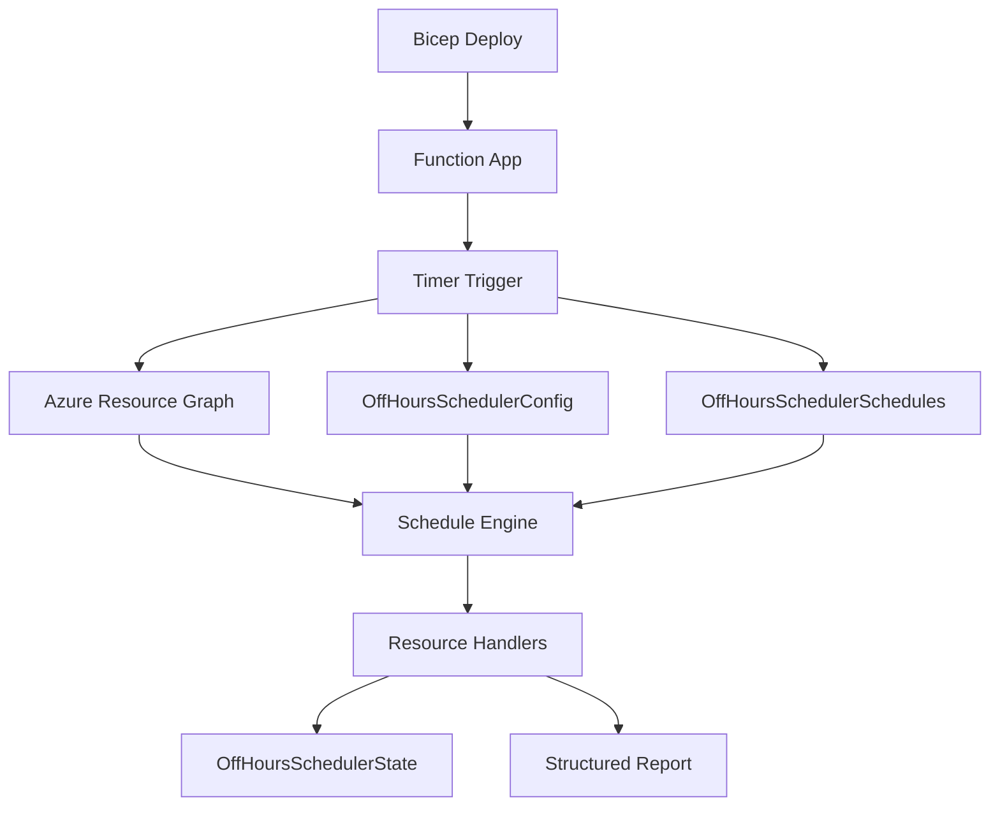

[Projeto no GitHub: DavidFerreira21/azure-offhours-scheduler](https://github.com/DavidFerreira21/azure-offhours-scheduler)

O **Azure OffHours Scheduler** foi criado para automatizar `start` e `stop` de recursos Azure fora do horário útil sem cair nos problemas mais comuns desse tipo de automação: regra hardcoded, escopo frágil, override manual desfeito cedo demais e operação dependente de redeploy.

Em vez de empacotar toda a lógica em scripts isolados, a solução adota um modelo **table-driven**, com regras operacionais em **Azure Table Storage**, escopo controlado por subscription e management group, execução por **Azure Functions** e descoberta centralizada via **Azure Resource Graph**.

## Contexto

Grande parte das automações off-hours começa simples: um script, um cron e uma lista fixa de recursos. Isso funciona em ambientes pequenos, mas costuma quebrar quando o cenário ganha escala.

Os problemas se repetem:

- schedules ficam presos em arquivo ou app setting;
- mudar janelas operacionais exige código ou redeploy;
- o escopo entre subscriptions vira operação manual;
- overrides manuais são desfeitos sem critério;
- os logs mostram que algo rodou, mas não explicam bem o resultado.

Em ambientes enterprise, isso deixa de ser apenas uma questão de economia. Vira um problema de governança operacional.

## Objetivo

O objetivo da solução é reduzir custo de compute ocioso no Azure com uma abordagem centralizada, auditável e segura, mantendo três propriedades principais:

- mudança operacional sem redeploy;
- escopo explícito e controlado;
- observabilidade útil por ciclo e por recurso.

## TL;DR

O fluxo principal é este:

`Bicep -> Function App -> Timer -> Tabelas -> Resource Graph -> Engine -> Handlers -> State -> relatório estruturado`

Em vez de depender de schedules embutidos no código, o runtime usa app settings apenas para configuração técnica e lê as regras operacionais nas tabelas a cada ciclo.

## Arquitetura e fluxo

O desenho da solução separa com clareza infraestrutura, runtime e operação.



Em alto nível:

- o **Bicep** cria a infraestrutura e configura o runtime técnico;
- o **Timer Trigger** dispara o ciclo do scheduler;
- a aplicação lê a **config global** e os **schedules** nas tabelas;
- o **Resource Graph** encontra os recursos elegíveis;
- o **Schedule Engine** decide `START`, `STOP` ou `SKIP`;
- os **handlers** executam a ação real;
- a tabela de **state** registra histórico operacional e apoia as regras de retain;
- o ciclo fecha com **relatório estruturado** e logs consolidados.

## O que fica em app settings e o que fica nas tabelas

Esse ponto é central no projeto.

As **app settings** definem o ambiente técnico do runtime, por exemplo:

- `AZURE_SUBSCRIPTION_IDS`
- `TARGET_RESOURCE_LOCATIONS`
- `SCHEDULER_TABLE_SERVICE_URI`
- `MAX_WORKERS`
- `TIMER_SCHEDULE`
- `RESOURCE_RESULT_LOG_MODE`

Esses valores dizem **onde** e **como** a Function executa. Eles não definem o comportamento operacional do scheduler.

As **tabelas**, por outro lado, definem a regra de negócio:

- qual a tag usada para identificar o schedule;
- qual o timezone padrão;
- se `DRY_RUN` está ligado;
- quais janelas existem;
- quais subscriptions ou management groups entram ou ficam fora;
- como o scheduler trata override manual.

Essa separação é o que permite ajustar o comportamento da solução sem publicar novamente a Function.

## As três tabelas operacionais

O modelo da solução gira em torno de três tabelas:

- `OffHoursSchedulerConfig`
- `OffHoursSchedulerSchedules`
- `OffHoursSchedulerState`

### OffHoursSchedulerConfig

Essa tabela guarda a configuração global do runtime, em uma entidade como `GLOBAL/runtime`.

Os campos mais importantes são:

- `DRY_RUN`
- `DEFAULT_TIMEZONE`
- `SCHEDULE_TAG_KEY`
- `RETAIN_RUNNING`
- `RETAIN_STOPPED`
- `Version`
- `UpdatedAtUtc`
- `UpdatedBy`

Na prática, ela controla o comportamento geral do ciclo.

### OffHoursSchedulerSchedules

Essa tabela guarda um registro por schedule. O `RowKey` é o nome referenciado na tag do recurso, por exemplo:

```text
schedule=business-hours
```

O formato preferido é `Periods`, porque ele permite múltiplas janelas no mesmo schedule. `Start` e `Stop` continuam úteis para janelas simples e edição rápida no Portal.

Ela também suporta escopo dinâmico com:

- `IncludeSubscriptions`
- `ExcludeSubscriptions`
- `IncludeManagementGroups`
- `ExcludeManagementGroups`

Com uma regra importante: **`exclude` sempre vence `include`**.

### OffHoursSchedulerState

Essa tabela registra o estado operacional do recurso e é o que permite respeitar override manual de forma consistente.

Ela guarda informações como:

- último estado observado;
- última ação executada;
- se o recurso foi iniciado ou parado pelo scheduler;
- timestamp da atualização.

Sem esse estado, o scheduler tenderia a desfazer intervenções humanas cedo demais.

## Como a solução funciona no dia a dia

O recurso entra no ciclo por tag:

```text
schedule=business-hours
```

Opcionalmente, ele também pode definir timezone próprio:

```text
timezone=America/Sao_Paulo
```

A ordem lógica da avaliação é esta:

1. Ler a tag de schedule no recurso.
2. Localizar o schedule correspondente na tabela.
3. Verificar se o recurso está no escopo válido.
4. Resolver o timezone do recurso.
5. Aplicar `SkipDays`, janelas e períodos.
6. Decidir entre `START`, `STOP` ou `SKIP`.

Isso evita que o runtime tenha comportamento implícito. O escopo e a decisão ficam auditáveis.

## Escopo dinâmico e governança

Um dos pontos mais fortes do projeto é o tratamento de escopo.

O deploy aceita combinação de:

- `subscriptionIds`
- `managementGroupIds`
- `excludeSubscriptionIds`
- `targetResourceLocations`

O detalhe importante é que a resolução de `managementGroupIds` e exclusões acontece no **script de deploy**, não no runtime. O wrapper monta o escopo técnico efetivo antes da execução da Function. Em runtime, a aplicação opera sobre esse universo já resolvido.

Isso ajuda a manter o desenho previsível:

- o deploy define o universo técnico monitorado;
- as tabelas refinam a regra operacional;
- a engine decide o que fazer em cada recurso encontrado.

## Retain de override manual

Esse projeto não tenta automatizar de forma agressiva. Ele tenta automatizar com segurança.

Hoje existem dois comportamentos relevantes:

- `RETAIN_RUNNING`: se alguém ligar manualmente uma VM fora da janela, o scheduler pode respeitar isso temporariamente;
- `RETAIN_STOPPED`: se alguém desligar manualmente uma VM dentro da janela, o scheduler pode manter esse estado no comportamento atual.

Na prática:

- `RETAIN_RUNNING` é **temporário**;
- `RETAIN_STOPPED` é **persistente** no desenho atual.

Esse detalhe operacional faz diferença real, porque evita que a automação entre em conflito com decisões humanas legítimas.

## Operação e observabilidade

Cada execução gera um `run_id` e publica um relatório estruturado com dados como:

- `summary`
- `duration_sec`
- `dry_run`
- lista de recursos processados

Além disso, a solução permite controlar o volume de logs por recurso com `RESOURCE_RESULT_LOG_MODE`. O modo recomendado para uso normal é:

```text
RESOURCE_RESULT_LOG_MODE=executed-and-errors
```

Isso mantém:

- resumo final do ciclo sempre presente;
- relatório JSON final sempre presente;
- logs por recurso apenas para `EXECUTED` e `FAILED`.

Para validação inicial, o caminho seguro é começar com:

```text
DRY_RUN=true
```

Assim, o scheduler calcula e registra o que faria, sem executar `start` ou `stop` de verdade.

## Infraestrutura e deploy

A infraestrutura é provisionada por **Bicep** e inclui:

- Storage Account;
- Azure Table Storage;
- Function App;
- App Service Plan;
- Log Analytics;
- Application Insights;
- Managed Identity;
- role assignments nas subscriptions monitoradas.

O deploy recomendado usa um wrapper que:

- valida ferramentas e autenticação;
- resolve o escopo efetivo da solução;
- executa o deploy da infraestrutura;
- faz bootstrap das tabelas;
- prepara e publica a Function.

Esse bootstrap inicial já pode criar:

- a entidade global com valores default;
- o schedule `business-hours`.

Isso acelera a primeira validação e reduz o esforço para sair do zero.

## Recursos suportados hoje

No estado atual do projeto, a execução real está implementada para:

- `Microsoft.Compute/virtualMachines`

O roadmap já menciona evolução para:

- `VirtualMachineScaleSets`
- `App Services`

Mas esses itens devem ser tratados como próximos passos, não como suporte já entregue.

## Quick Start

O fluxo mínimo para subir a solução é este:

```bash
python3 -m venv .venv
source .venv/bin/activate
pip install -r requirements.txt
cp infra/bicep/main.parameters.example.json infra/bicep/main.parameters.json
az login
make deploy
```

Depois do deploy:

- valide a entidade global na tabela `OffHoursSchedulerConfig`;
- valide o schedule inicial em `OffHoursSchedulerSchedules`;
- marque uma VM com `schedule=business-hours`;
- mantenha `DRY_RUN=true` no primeiro ciclo;
- confirme a decisão pelos logs e pelo relatório estruturado;
- só depois habilite a execução real.

## Conclusão

O valor do Azure OffHours Scheduler não está apenas em desligar VMs fora do horário útil. O ponto mais forte é transformar essa automação em um padrão operacional governável.

Quando o comportamento do scheduler fica nas tabelas, o escopo é explícito, o deploy resolve o universo técnico corretamente e os overrides manuais são respeitados, a solução deixa de ser apenas um script de economia. Ela passa a ser uma peça real de **FinOps**, **governança** e **engenharia de plataforma** no Azure.
