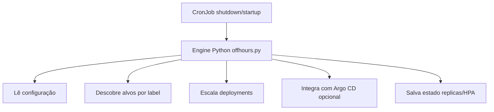

[Projeto no GitHub: DavidFerreira21/K8s-OffHours](https://github.com/DavidFerreira21/K8s-OffHours)

O **K8s OffHours** automatiza o `shutdown` e `startup` de workloads Kubernetes fora do horário útil, reduzindo desperdício em ambientes não produtivos.

Para gerar **economia real de infraestrutura**, a solução precisa ser combinada com autoscaling de nós, como **Karpenter** ou **Cluster Autoscaler**, permitindo remover workers ociosos de forma dinâmica.

## Contexto

Em muitos clusters Kubernetes, ambientes de desenvolvimento, QA e homologação continuam rodando **24x7**, mesmo quando não estão sendo utilizados.

O resultado é consumo desnecessário de recursos, com pods e nós ativos fora da janela operacional.

Em ambientes corporativos, é comum que workloads usados apenas no horário comercial consumam muitas horas ociosas ao longo do mês, gerando desperdício significativo de infraestrutura.

O **K8s OffHours** resolve esse problema automatizando dois momentos:

- **shutdown**: reduz workloads elegíveis para `replicas=0`
- **startup**: restaura as réplicas no início da janela operacional

Com isso, o time mantém previsibilidade operacional e reduz desperdício em ambientes não produtivos.

## Como funciona

O funcionamento é baseado em `CronJob` + uma engine em Python:



Resumo da arquitetura:

- Dois CronJobs executam em horários diferentes (`shutdown` e `startup`).
- O alvo é definido por label `offhours.platform.io/schedule=<nome>`.
- O escopo pode ser por namespace ou por deployment.

Esse fluxo permite desligar workloads fora da janela operacional e restaurar automaticamente o estado anterior no início do próximo ciclo de trabalho.

## Implementação prática

### Pré-requisitos

- Cluster Kubernetes com permissão para criar namespace, RBAC, CronJob e ConfigMap.
- Helm instalado na máquina de operação.
- `kubectl` configurado para o contexto correto.
- Workloads alvo com label `offhours.platform.io/schedule=<nome>`.
- Autoscaler de nós habilitado para economia real (Karpenter ou Cluster Autoscaler).

### Instalação via Helm

```bash
helm repo add k8s-offhours https://davidferreira21.github.io/K8s-OffHours
helm repo update

helm upgrade --install offhours k8s-offhours/k8s-offhours \
  -n offhours-system --create-namespace \
  --set config.scheduleName=default \
  --set config.scheduleScope=namespace \
  --set argocd.enabled=false
```

### Marcar alvos com label

```bash
# Escopo namespace
kubectl label ns <namespace> offhours.platform.io/schedule=default --overwrite

# Escopo deployment
kubectl -n <namespace> label deploy <deployment> offhours.platform.io/schedule=default --overwrite
```

### Como testar

Você pode executar manualmente os jobs para validar o comportamento sem esperar o horário do cron:

```bash
kubectl -n offhours-system create job --from=cronjob/offhours-k8s-offhours-shutdown manual-shutdown
kubectl -n offhours-system create job --from=cronjob/offhours-k8s-offhours-startup manual-startup
```

Validações úteis:

```bash
kubectl -n offhours-system get jobs,pods
kubectl -n <namespace> get deploy
kubectl -n <namespace> get deploy <deployment> -o jsonpath='{.spec.replicas}{"\n"}'
```

Resultado esperado:

- no `manual-shutdown`, os Deployments elegíveis devem ir para `replicas=0`;
- no `manual-startup`, as réplicas devem voltar ao valor anterior;
- workloads protegidos por annotation devem ser ignorados.

### Como visualizar logs

```bash
kubectl -n offhours-system logs -f job/manual-shutdown
kubectl -n offhours-system logs -f job/manual-startup
```

Se preferir acompanhar o pod diretamente:

```bash
kubectl -n offhours-system get pods -l job-name=manual-shutdown
kubectl -n offhours-system logs -f <pod-name>
```

### Por que autoscaling de nós é essencial para economia real

O K8s OffHours reduz pods, mas não remove workers sozinho.

Para que os workers sejam removidos dinamicamente, é necessário um autoscaler de nós, como:

- Karpenter (EKS e ambientes compatíveis)
- Cluster Autoscaler
- VMSS Autoscaling (AKS)
- Node Auto Provisioning (GKE)

Fluxo esperado:

1. O `shutdown` coloca os Deployments em `replicas=0`.
2. Os nós ficam vazios ou subutilizados.
3. O autoscaler identifica capacidade ociosa e deprovisiona workers.
4. No `startup`, novos pods são criados e o autoscaler reprovisiona nós se necessário.

Sem autoscaling de nós, os pods até param, mas os workers continuam ligados e o custo de infraestrutura permanece alto.

Pontos de atenção para o scale-down funcionar bem:

- habilitar consolidação ou scale-down no autoscaler;
- revisar `PodDisruptionBudget`;
- avaliar `DaemonSets` que mantêm node ocupado;
- ajustar janelas para evitar ciclos frequentes de liga/desliga.

## Desafios comuns

Problemas comuns na adoção:

- **Label incorreta**: `scheduleName` diferente do valor aplicado no namespace/deployment.
- **GitOps revertendo escala**: Argo CD ou Flux pode restaurar réplicas automaticamente.
- **HPA reescalando workloads**: em alguns cenários, o HPA pode conflitar com `replicas=0`.
- **Falta de autoscaling de nós**: reduz pods, mas não reduz custo de infraestrutura.
- **Workloads stateful**: alguns serviços podem exigir tratamento específico antes de escalar para zero.

## Conclusão

O K8s OffHours é uma abordagem simples e eficaz para reduzir custos em ambientes Kubernetes não produtivos sem perder controle operacional.

Exemplo rápido de economia:

- ambiente de desenvolvimento com 4 workers rodando 24x7;
- desligando por 12 horas por dia em dias úteis;
- com autoscaling ativo, workers ociosos podem ser removidos automaticamente.

Principais aprendizados:

- padronizar labels e janelas de execução evita comportamentos inesperados;
- validar com jobs manuais antes de ativar em produção reduz riscos;
- observabilidade por logs é essencial para operação segura;
- OffHours + autoscaling de nós é a combinação que realmente reduz custo de compute.

Mais do que apenas reduzir custo, o K8s OffHours introduz um padrão operacional simples para ambientes não produtivos, alinhando consumo de infraestrutura com a demanda real dos workloads.

### O código do K8s OffHours está disponível no GitHub:

https://github.com/DavidFerreira21/K8s-OffHours
